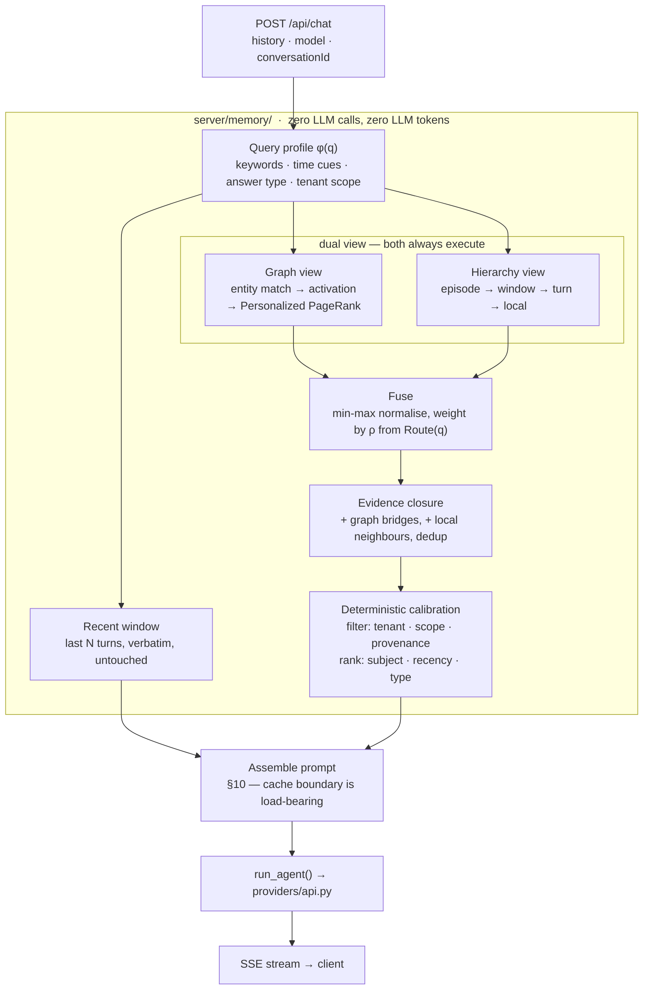
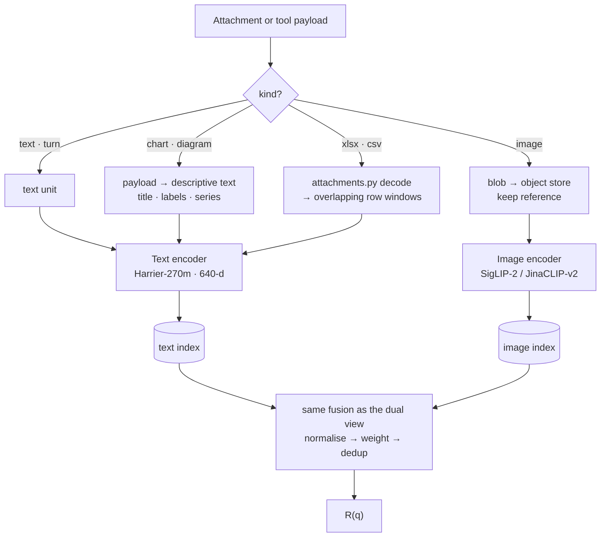
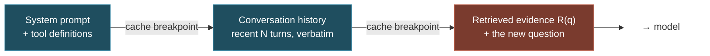
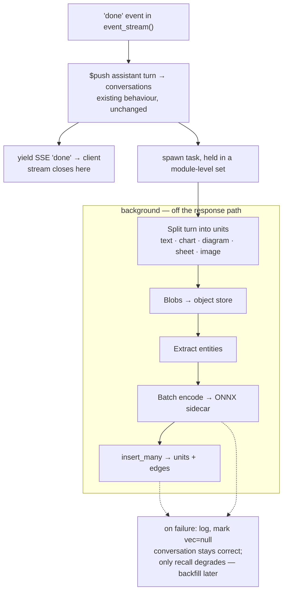

# Memory & Retrieval for Diagrammer

**A production memory layer, adapted from Zero-Mem (arXiv:2607.29377).**
Target: many concurrent users, self-hosted, multilingual, multimodal, CPU-first.

Status: **phases 1–3 are built** (see `PROGRESS.md` milestones 23, 26 and 29).
This document is kept as the design of record and is *not* edited to match the
code — where the two disagree, the code is what runs. Two disagreements worth
knowing before you trust a section: §9's claim that the entity graph is
populated from day one "so there is nothing to backfill later" was never true of
the build (`python -m server.memory.backfill` exists because of it), and §20's
phase ordering assumed an evaluation set (§16) that still does not exist, so the
fusion weights shipped as fixed constants rather than tuned ones. Phase 4
(multimodal, §8) and `Route(q)` remain unbuilt.

> **How to read this.** Sections 1–3 are the reasoning and the transferable lessons.
> Sections 4–12 are the design. Sections 13–19 are what turns a working prototype into
> a system you can operate — the parts that are invisible in a paper and account for
> most of the work in a real deployment. Section 20 is the phased plan.

---

## 1. Source and the honest read

[Zero-Mem: Zero-Token Memory Operations for LLM Agents](https://arxiv.org/abs/2607.29377)
(Xiao et al., 31 Jul 2026) argues that structured agent memory needs **no LLM calls
outside final question answering**. It keeps raw interaction traces as the source of
record and builds two non-generative views over them — an entity–context graph and a
temporal hierarchy — then fuses, filters, and hands the result to one reader LLM.

On LoCoMo with an identical reader and context budget: **59.15 F1 vs 53.75 for the
strongest baseline, with 0 memory-operation tokens and 0.22 s/query** — a 57.6%
latency cut against the fastest baseline compared. Ablation on HotpotQA: full model
72.07 F1, graph-only 62.50, hierarchy-only 54.88. The two views are genuinely
complementary, which is the empirical basis for building both (§9).

### What transfers

| Paper idea | Verdict | Reasoning |
|---|---|---|
| Zero LLM calls in the memory path | **Adopt** | Every memory-path LLM call is latency and cost on the critical path of a live SSE stream. This is the single most valuable property to preserve. |
| Provenance-preserving raw units | **Adopt, emphatically** | A `render_chart` payload — title, series names, real numbers — is already structured and already exact. Summarising it destroys the data a follow-up needs. |
| Temporal hierarchy | **Adopt** | Chat is ordered. "Change the colour to blue" is meaningless without the turn before it. |
| Entity–context graph + Personalized PageRank | **Adopt** (§9) | Cross-conversation recall. Nothing else provides it. |
| Query-conditioned routing `Route(q)` | **Adopt, but ship with a fixed weight** | The mechanism is cheap; the *tuning* needs an eval set that doesn't exist yet (§16). Build the seam, start with a constant. |
| Post-reader answer calibration (Eq. 16) | **Drop permanently** | It extracts and substitutes a type-compatible *scalar answer*. This app emits diagrams and prose. There is no scalar to calibrate. |

### The honest counter-argument, kept on the record

Zero-Mem is tuned for LoCoMo: hundreds of turns across many sessions. Today's
Diagrammer conversations are short enough to fit in context whole, and on the `api`
transport **prompt caching alone** answers "replaying history is expensive" — cache
reads cost ~0.1× input against a 1.25× write premium, so it pays for itself on the
second request.

Caching stops being sufficient at exactly two points, and both are on your roadmap:

- Caches are **model-scoped**. The model picker means Opus → Sonnet is a cold cache.
- Caching makes *replay* cheap. It does nothing for **cross-conversation recall**, and
  nothing once one conversation exceeds the window.

So the design uses both — caching for the recent window, retrieval for deep history.
§10 covers the non-obvious part: composing them so one doesn't destroy the other.

---

## 2. Design principles

These are the parts worth carrying to any large system, not just this one.

**Separate the mechanism from the policy.** Fusion weight `ρ`, damping `γ`, window
size `N`, budget `K` are *policy*. They belong in config, tuned against an eval set —
never as literals inside the retrieval loop. The paper's own numbers make the case: its
`ρ = γ = 0.6` were tuned on LoCoMo and HotpotQA, and there is no reason those transfer
to a diagramming assistant. Build the knob; don't trust the paper's setting.

**Put a seam wherever you will later want a different answer.** The encoder will
change — a better model ships every few months. The store will change when brute-force
scoring hits its ceiling. Both go behind a narrow interface from day one (§5). This is
not speculative generality: both changes are *scheduled*, not hypothetical.

**Decide what degrades and what fails.** Memory is an enhancement. If the encoder is
down, the chat must still work with a shorter context. Design the degradation ladder
before the first outage, not during it (§17).

**A retrieval system over user data is a security boundary before it is a feature.**
One missing tenant filter puts another user's private conversation into an LLM prompt.
This is the highest-severity bug class in the whole design and it gets structural
defence, not a code review (§13).

**You cannot tune what you cannot measure.** Every parameter above is unanswerable
without a golden set. Building the eval harness *before* the tuning work is the
difference between engineering and guessing (§16).

**Version your derived data.** Embeddings are a function of (model, pooling, prompt,
dimension). Change any input and every stored vector silently becomes meaningless —
with no error, just quietly worse results. This is the single most common way a
production RAG system rots (§15).

---

## 3. Hard prerequisites

Not optional for a multi-user deployment.

**3.1 — `agent-sdk` is disqualified.** `CLAUDE.md` is unambiguous: Anthropic's terms
forbid offering claude.ai login/rate limits to other users, and `query()` only picks up
the subscription because it shells out to *this machine's* local `claude` CLI.
Production means setting `ANTHROPIC_API_KEY`, so `resolve_claude_transport()` returns
`'api'`. That is also the only transport with prompt caching and image input.

**3.2 — The encoder must never block the event loop.** Every route in `main.py` is
`async def` on one loop, and the app's entire concurrency story rests on that. A
synchronous `sentence-transformers` call in-process stalls *every* concurrent user for
the duration of the forward pass. The encoder runs out-of-process (§7).

**3.3 — Local MongoDB Community has no `$vectorSearch`.** That operator is Atlas-only.
Vector scoring happens in the app process behind an interface, with a stated ceiling
and a named upgrade path (§21).

---

## 4. Query-time architecture



Everything in the shaded region is deterministic — vector arithmetic, string matching,
sorting. No model is prompted anywhere inside it. The encoder is a forward pass, which
Zero-Mem accounts separately from LLM tokens; that accounting is honest and this design
inherits it.

---

## 5. Ports and adapters

Three interfaces. Everything else is free to change behind them.

```python
class Encoder(Protocol):
    model_id: str          # travels with every vector it produces (§15)
    dim: int
    async def encode(self, texts: list[str], *, is_query: bool) -> list[bytes]: ...

class UnitStore(Protocol):
    async def put(self, units: list[MemoryUnit]) -> None: ...
    async def recent(self, scope: Scope, n: int) -> list[MemoryUnit]: ...
    async def lexical(self, scope: Scope, terms: str, k: int) -> list[Scored]: ...
    async def dense(self, scope: Scope, vec: bytes, k: int) -> list[Scored]: ...

class GraphStore(Protocol):
    async def neighbours(self, scope: Scope, entities: list[str]) -> Subgraph: ...
```

Two things this buys, both already scheduled rather than speculative:

- **`Encoder`** — swapping Harrier for whatever ships next year, or adding a second
  encoder for images (§8), touches one adapter.
- **`UnitStore.dense`** — the in-process numpy implementation and a future Qdrant
  adapter are the same signature. Migration becomes a config change plus a backfill,
  not a rewrite.

`Scope` is a value object carrying `owner_id` and optional `conversation_id`. It is the
*only* way to express a query filter — see §13 for why that matters more than it looks.

---

## 6. What lives in memory: units

Every retrievable thing is a `MemoryUnit`. The kinds differ; the interface does not.

| Kind | Source | Text used for embedding | Blob stored? |
|---|---|---|---|
| `turn` | A user or assistant message | The message text | no |
| `chart` | `render_chart` tool payload | Title + axis labels + series names + a data digest | payload inline (small) |
| `diagram` | `render_diagram` tool payload | Title + node labels + edge labels | payload inline (small) |
| `sheet` | `.xlsx` / `.csv` attachment | Header row + a window of data rows (§8) | object store |
| `image` | Image attachment | — (embedded in image space, §8) | object store |

**Charts and diagrams are the highest-value units in the schema.** Their titles, series
names, and numbers are already structured and already exact. Stored verbatim, retrieved
verbatim — Zero-Mem's provenance principle landing somewhere the paper never had it.

---

## 7. Encoder: Harrier-OSS-v1-270m

**Replaces the earlier BGE-M3 recommendation.** You were right to push on size.

[`microsoft/harrier-oss-v1-270m`](https://huggingface.co/microsoft/harrier-oss-v1-270m):

| | Harrier-270m | BGE-M3 (previous pick) |
|---|---|---|
| Parameters | **270M** | 568M |
| Dimensions | **640** | 1024 |
| Context window | **32,768** | 8,192 |
| Languages | 94, incl. Vietnamese | 100+ |
| MTEB v2 (multilingual) | **66.5** | lower |
| License | **MIT** | MIT |
| CPU-viable | **yes — ONNX build published** | marginal |

Half the parameters, **1.6× less storage per vector** (640 × 4 B = 2.5 KB vs 4 KB), 4×
the context, better multilingual benchmark, and an [ONNX
build](https://huggingface.co/onnx-community/harrier-oss-v1-270m-ONNX) that runs on
CPU without pulling torch into anything. For a CPU-first deployment this is a clear
win. Vietnamese is in the supported set, which was the requirement that killed
`bge-small-en-v1.5`.

### Two things that will bite if missed

**1. Queries and documents are encoded asymmetrically.** Harrier requires a
task-instruction prefix on *queries* and none on documents. Encode both the same way
and retrieval quality drops with no error to tell you. This is why `Encoder.encode()`
takes `is_query` rather than inferring it:

```python
model.encode(queries, prompt_name="web_search_query")   # queries: instruction prefix
model.encode(documents)                                  # documents: none
```

**2. It is decoder-only with last-token pooling.** That is an unusual architecture for
an embedding model, and **TEI may not support it** — TEI's architecture support is
explicit, not automatic. Verify before assuming. The guaranteed-working CPU path is the
published ONNX build behind `onnxruntime` in a small sidecar; that is also leaner than
TEI on CPU, since TEI's advantages (Flash Attention, aggressive batching) are GPU-side.

> **Serving decision.** ONNX Runtime sidecar, called over `httpx` (already installed
> transitively via `anthropic`/`openai` — no new dependency). Upgrade to TEI on GPU
> only if encode latency shows up in traces, and only after confirming architecture
> support.

**What this costs elsewhere:** BGE-M3 emits sparse lexical weights in the same forward
pass, which I had floated as a free multilingual signal for entity extraction. Harrier
does not. That option is gone — §22 covers what replaces it.

---

## 8. Multimodal: sheets and images

### Sheets — mostly already solved

`server/attachments.py` already converts `.xlsx` to a markdown table and decodes CSV
through a three-codec ladder (including cp1258, which is what Excel writes on a
Vietnamese locale). By the time `run_agent` sees it, a sheet **is text**. Harrier's
32k-token window swallows a substantial table whole.

One real subtlety: **the prompt copy and the memory copy have different budgets.**
`attachments.py` caps at `MAX_ROWS = 300` because that is what belongs in a prompt.
Memory should index the *whole* sheet as overlapping row-window units, so a question
about row 900 is answerable later. Same source file, two derived representations,
different truncation rules. Getting this wrong means memory silently inherits a
prompt-shaped limit that has no reason to apply to it.

### Images — the architectural question

Images cannot ride the text encoder. Two ways forward, and they differ in whether the
zero-token property survives:

| Approach | Zero-token preserved? | Trade-off |
|---|---|---|
| **A. Caption with a VLM at ingest, index the caption** | **No** — a generative call | Reuses the whole text pipeline. The call is at *write* time, off the SSE critical path, so latency is fine — but the paper's central property is gone and cost scales with uploads. |
| **B. Multimodal encoder, image vectors in their own index** | **Yes** | Needs a second model. Cross-modal ranking is harder to calibrate. |

**Recommendation: B.** It keeps the property the whole design is built around, and it
composes with what is already here — see below. Candidates:
[SigLIP-2](https://www.spheron.network/blog/multimodal-embedding-models-gpu-cloud-siglip2-jinaclip-cohere/)
(strongest open image-text model as of mid-2026), **JinaCLIP-v2** (multilingual text
tower plus Matryoshka dims — truncate to 64-d for cheap storage), or **Qwen3-VL-2B**,
notable for a small *modality gap* (0.25 vs 0.73 for a leading closed model), which is
precisely what governs whether a text query can retrieve an image at all.

> **Modality gap** is the concept to internalise here: in a joint space, text and image
> embeddings tend to occupy separate cones. A large gap means text-to-image retrieval
> degenerates to noise regardless of how good either tower is. It matters far more than
> the headline benchmark number.

### The insight that makes this cheap

Zero-Mem's fusion machinery — min-max normalise per view, weight, combine (Eq. 12–13) —
**is modality-agnostic**. You build it once for `(graph, hierarchy)` and reuse it
unchanged for `(text, image)`. The `Encoder` port already permits two implementations.



**Blobs never go in MongoDB.** `db.py` already notes the 16 MB document ceiling, and
`main.py` deliberately drops attachments before persisting a turn. Images and source
spreadsheets go to S3-compatible object storage (MinIO self-hosted); the unit holds a
key, not bytes.

---

## 9. Both views from day one

Per your point 3 — the graph is in the schema and the interfaces from the start, even
while the tuning is immature. The paper's ablation justifies it (graph-only 62.50 vs
full 72.07 on HotpotQA), and retrofitting a graph onto a hierarchy-only schema means
re-processing every historical unit.

What ships enabled and what ships behind a flag are different questions:

| Component | Schema | Code | Enabled by default |
|---|---|---|---|
| Hierarchy view | day one | day one | **yes** |
| Entity extraction + edges | day one | day one | **yes** — write path always populates |
| Graph view (PPR) at query time | day one | day one | flag, default off |
| `Route(q)` | day one | day one | fixed `ρ`, dynamic routing behind a flag |

The graph is *populated* from the first write even while it is not *read*. That is the
whole point: the day you flip the flag, the history is already there. Backfilling
entities across a year of conversations later is a migration; writing them from the
start is free.

Personalized PageRank stays ~15 lines of power iteration over a dict-of-dicts.
`networkx` is a dependency for one textbook loop over a graph of hundreds of nodes.

---

## 10. Retrieval and prompt caching must be composed deliberately

**Easy to get wrong, expensive to discover later.**

Prompt caching is a *prefix match*: any byte changing at position N invalidates every
cached block after N. Retrieved evidence changes every turn by definition. So the naive
layout — system prompt, evidence, conversation — invalidates the entire history on
every request. You pay the 1.25× write premium every turn and never read from cache
once.

The fix is ordering. Evidence goes **last**, inside the current user turn:



Blue is stable and caches across turns. Orange is volatile and recomputed every turn —
fine, because nothing cached sits behind it.

- **The recent window is append-only.** If retrieval reorders or drops a turn inside
  the cached region, the cache dies. Prune from the *old* end only.
- **Model switching costs a cold cache.** Caches are model-scoped; the picker is
  per-request. Not a bug — but know it before someone files it as one.
- **Watch the 20-block lookback.** A breakpoint searches back at most 20 content blocks.
  A turn emitting many `render_chart` calls can exceed that in one turn and silently
  miss. Place an intermediate breakpoint if turns get tool-heavy.

---

## 11. Data model

```
memory_units {
  _id, ownerId, conversationId,          // ownerId is a security boundary — §13
  kind:        "turn" | "chart" | "diagram" | "sheet" | "image",
  role:        "user" | "assistant",
  text:        original text — never a summary,
  payload:     raw tool dict, for chart/diagram,
  blobKey:     object-store key, for sheet/image,
  seq, at:     position + timestamp,

  entities:    [ "SJC", "2026-Q1", ... ],  // populated from day one — §9

  vec:         Binary(float32[dim]),
  embedModel:  "harrier-oss-v1-270m",      // §15 — vectors are only comparable
  embedDim:    640,                        //       within one (model, dim) pair
  embedSpace:  "text" | "image"
}

memory_edges {
  ownerId, src, dst, weight, kind: "cooccur" | "adjacent"
}
```

Indexes:

```
{ ownerId: 1, conversationId: 1, seq: 1 }        // hierarchy walk, recent window
{ ownerId: 1, at: -1 }                            // cross-conversation recency
{ ownerId: 1, embedSpace: 1, embedModel: 1 }      // vector scan, never mixes spaces
{ ownerId: 1, entities: 1 }                       // graph entry points
{ text: "text" }                                  // lexical signal
```

**Scoping is what makes this scale.** Every query filters `ownerId` first, so cost
tracks one user's history depth, not the size of the user base. A thousand users do not
slow any single query.

---

## 12. Write path

Indexing must never delay the stream the user is watching.



Two details that bite in production:

- **Hold a reference to the task.** `asyncio.create_task` without a live reference lets
  the GC cancel it mid-flight. Module-level `set`, discard on completion.
- **Indexing failure is non-fatal by construction.** If the encoder is down, the
  conversation is still written and still correct; the units are just not yet
  retrievable. A backfill job sweeps `vec: null`. This is the same design instinct
  `main.py` already applies to a dead MongoDB at startup.

---

## 13. Tenant isolation

**The highest-severity bug class in this entire design.** A missing `ownerId` filter
does not throw, does not log, and does not fail a test that only ever runs with one
user. It puts another person's private conversation into an LLM prompt — and the model
will happily use it.

Structural defence, not vigilance:

- **`Scope` is the only way to build a filter.** No function in the memory package
  accepts a raw Mongo filter dict. Every `UnitStore` method takes `Scope` as its first
  argument, and `Scope` cannot be constructed without an `owner_id`.
- **Filter before scoring, never after.** Load only this tenant's vectors into the
  matrix. A post-hoc filter on results is one refactor away from being dropped.
- **The test that matters:** seed two users with deliberately similar content, query as
  A, assert nothing belonging to B appears at any stage — units, edges, or final `R(q)`.
  This is the one test that must exist before this ships to a second user.
- **Deletion must cascade.** `DELETE /api/conversations/{id}` currently removes one
  document. With memory it must also remove that conversation's units, edges, and
  blobs, or deleted content stays retrievable — a correctness bug and a privacy one.

---

## 14. Degradation ladder

Memory is an enhancement. Decide now what happens when each dependency fails.

| Failure | Behaviour | User sees |
|---|---|---|
| Encoder sidecar down | Skip dense; lexical + recent window only | Slightly worse recall |
| Encoder slow (> budget) | Time out, same as above | Normal latency |
| Graph view errors | Fall back to hierarchy-only | Slightly worse on multi-hop |
| Object store down | Text units still retrieved; blob refs unresolved | Missing image context |
| `memory_units` unavailable | `select_context` returns its input verbatim | Exactly today's behaviour |

The last row is the important one: **the memory layer's total failure mode is the
current product.** That is what makes it safe to ship incrementally, and it should be
enforced with a timeout and a `try` around the whole of `select_context` — never a
`raise` into `event_stream`.

---

## 15. Embedding model migration

The classic way a production RAG system rots quietly.

A vector is only meaningful relative to the exact `(model, dimension, pooling, query
prompt)` that produced it. Change the model and every stored vector is now noise
compared against new queries — **no error, no exception, just steadily worse results
that nobody attributes to the migration.** Harrier's asymmetric query prompt (§7) adds
a second way to get this wrong within a single model.

The defence is the `embedModel` / `embedDim` / `embedSpace` fields in §11, plus a rule:

> **A query never scores against vectors from a different `(embedModel, embedSpace)`
> than the one that encoded it.** This is enforced in the index filter, not by
> convention.

Migration is then a dual-write, never a stop-the-world:

1. Deploy the new encoder alongside the old. Both are registered `Encoder`s.
2. New writes produce vectors under both models.
3. A backfill job re-encodes history under the new model, oldest-first.
4. Queries keep using the old model until backfill completes.
5. Flip the read path. Drop the old vectors once you are satisfied.

Budget for this: 100k units at 270M params on CPU is hours, not minutes. It is a
scheduled job, not a deploy step.

---

## 16. Evaluation harness

**Build this before tuning anything.** `N`, `K`, `ρ`, `γ`, and the graph flag are five
interacting knobs. Without measurement, tuning them is superstition — and the paper's
values were fitted to different data.

Two layers, cheap first:

**Retrieval eval (offline, no LLM, seconds).** A golden set of ~50 queries against real
conversations with hand-labelled relevant unit IDs. Measure recall@K and MRR. This is
what you tune `ρ`, `K`, and the graph flag against, and it runs in CI.

**End-to-end eval (with a reader, minutes, costs money).** The same queries through the
full pipeline, scored on answer quality. Run before a release, not on every commit.

The paper's retrieval-budget curve is a useful prior for where to start looking:
top-1 → top-5 was the large jump (52.59 → 59.15 F1), top-10 peaked, and beyond that was
flat. Expect a similar shape and confirm it on your own traffic rather than adopting
`K = 5` because Zero-Mem did.

Seed the golden set from real conversations as soon as there are any — labelling 50 is
an afternoon, and it pays for itself the first time it stops a plausible-sounding change
from shipping a regression.

---

## 17. Observability

What to emit from `select_context`, per request:

- **Per-stage latency** — encode, dense, lexical, graph, fuse, calibrate. The stage that
  blows the budget is never the one you guessed.
- **Counts** — candidates per view, after fusion, after calibration. A view contributing
  nothing is a silent bug; a view contributing everything means `ρ` is wrong.
- **Cache effectiveness** — `cache_read_input_tokens` vs `cache_creation_input_tokens`
  from the response `usage`. If reads stay at zero across a conversation, something is
  invalidating the prefix (§10) and it is costing you 1.25× on every turn.
- **Degradation events** — every fallback in §14, counted. Silent degradation that
  nobody notices for a month is worse than an outage.
- **Encoder queue depth** — the leading indicator that the sidecar needs a GPU.

---

## 18. Rollout

1. **Shadow.** Run `select_context`, log what it *would* have returned, send the
   unmodified history to the model. Zero user risk; produces the traffic sample the
   golden set is built from.
2. **Canary behind a per-user flag.** Your own account first, then a handful.
3. **Ramp by percentage**, watching the §17 metrics and answer quality.
4. **Default on**, flag retained as the kill switch.

Shadow mode is the step teams skip and regret. It is the only way to see what retrieval
does on real traffic before it can affect anyone.

---

## 19. Multi-worker and capacity

The app already scales by running more uvicorn workers, and this design must not break
that.

- **No shared mutable state.** Per-worker LRU caches of a user's vector matrix are
  caches, never state — correctness must never depend on a hit.
- **The encoder sidecar is stateless.** Run two behind the load balancer; it is not a
  single point of failure by design.
- **Background indexing tasks are per-worker.** Fine — they are idempotent by unit ID.
  If you later need ordering or retries across workers, that is the moment to introduce
  a real queue, not before.
- **Rough sizing:** 640-d float32 = 2.5 KB/unit. 10k units/user ≈ 25 MB. Loading that
  from Mongo dominates the dot product, which is why the LRU exists.

---

## 20. Phases

Each phase ships independently. The schema (§11) and interfaces (§5) land in Phase 1
regardless, so no later phase requires reprocessing history.

### Phase 0 — Prerequisites and measurement

Set `ANTHROPIC_API_KEY` (§3.1). Stand up the ONNX encoder sidecar. Then measure:

```javascript
db.conversations.aggregate([
  { $project: { n: { $size: "$messages" },
                chars: { $sum: { $map: { input: "$messages",
                                         in: { $strLenCP: "$$this.text" } } } } } },
  { $group: { _id: null, avgTurns: { $avg: "$n" }, maxTurns: { $max: "$n" },
              maxChars: { $max: "$chars" } } }
])
```

Add prompt caching (§10) — worth it independently of everything else.

### Phase 1 — Full schema, hierarchy view, shadow mode

`memory_units` + `memory_edges`, the three ports, background indexing, entity
extraction writing edges. Query path uses the **hierarchy view only**; graph flag off.
Runs in shadow (§18). Tenant-isolation test (§13) is a merge blocker.

### Phase 2 — Live hierarchy retrieval, cross-conversation

Flip out of shadow behind the per-user flag. Widen scope from one conversation to one
user. Golden set built from Phase 1 shadow logs; `N` and `K` tuned against it.

### Phase 3 — Graph view on

Enable PPR at query time. The edges are already there from Phase 1 — nothing to
backfill. Tune `ρ` and `γ` against the same golden set, and confirm the paper's
complementarity result holds on your traffic.

### Phase 4 — Multimodal

Image encoder as a second `Encoder`, object storage, sheet row-window units. The fusion
code is unchanged from Phase 3 (§8).

---

## 21. Known ceilings

| Ceiling | Where it bites | Upgrade path |
|---|---|---|
| In-process cosine over a user's units | ~10k units/user (≈25 MB at 640-d). Mongo load dominates, not the dot product. | Per-worker LRU; then a Qdrant adapter behind `UnitStore.dense`. |
| Per-worker caches duplicate across workers | Memory grows with `--workers N` | Bound the LRU. It is a cache. |
| MongoDB `$text` is TF-IDF, not BM25 | Marginal ranking differences on rare terms | Only worth fixing if lexical recall measurably underperforms. |
| Fixed `ρ` instead of dynamic `Route(q)` | Relational queries rank slightly worse | Flag already in place — needs the eval set to tune, not new code. |
| Single encoder sidecar | Latency under load | Stateless; scale horizontally, then GPU + TEI. |
| Background tasks are per-worker, no retry | A worker restart loses in-flight indexing | The `vec: null` backfill sweep already covers it. A real queue is the next step, if ever. |

---

## 22. Open questions

**22.1 — Entity extraction, now that BGE-M3's sparse output is off the table (§7).**
The paper uses spaCy NER, but `en_core_web_sm` is English-only and fails the
multilingual requirement. In order of preference:

1. **Mongo `$text` terms plus regex** for numbers, dates, quoted strings, and
   identifiers — which is largely *what chart entities actually are*, and precisely
   what NER models are weakest at. Zero new dependencies.
2. spaCy `xx_ent_wiki_sm` (multilingual) layered on top of that.
3. A small multilingual NER model in the existing sidecar.

Worth noting the paper's entity graph records *observed co-occurrence*, not inferred
semantics — so extraction precision matters less than it first appears. Option 1 may
simply be sufficient.

**22.2 — Image encoder choice** (§8): SigLIP-2, JinaCLIP-v2, or Qwen3-VL-2B. Decide by
measuring modality gap on your own images, not by headline benchmark.

**22.3 — Is the recent window fixed or token-budgeted?** Fixed `N` is simpler and
cache-friendlier. Token-budgeted adapts better to conversations carrying large chart
payloads. Start fixed; revisit if large charts crowd out history.

---

## 23. Dependencies

Nothing installed. This needs your approval first.

| What | Where | Phase |
|---|---|---|
| `numpy` | conda-forge, `environment.yml` | 1 — vector scoring |
| `onnxruntime` | conda-forge | 1 — encoder sidecar (CPU, no torch) |
| Harrier-270m ONNX weights | model cache, not the repo | 1 |
| MinIO or S3 | container | 4 — blob storage |
| Image encoder | sidecar | 4 |
| spaCy multilingual | conda-forge | only if §22.1 resolves that way |

`httpx`, `pymongo`, `fastapi`, `pydantic`, and `openpyxl` are already present — `httpx`
arrives transitively via `anthropic`/`openai`, so the encoder client adds nothing.

---

## Sources

- [Zero-Mem: Zero-Token Memory Operations for LLM Agents](https://arxiv.org/abs/2607.29377) · [full text](https://arxiv.org/html/2607.29377v1)
- [microsoft/harrier-oss-v1-270m](https://huggingface.co/microsoft/harrier-oss-v1-270m) · [ONNX build](https://huggingface.co/onnx-community/harrier-oss-v1-270m-ONNX) · [Microsoft announcement](https://blogs.bing.com/search/April-2026/Microsoft-Open-Sources-Industry-Leading-Embedding-Model)
- [Multimodal embedding models compared](https://www.spheron.network/blog/multimodal-embedding-models-gpu-cloud-siglip2-jinaclip-cohere/) · [Text Embeddings Inference](https://github.com/huggingface/text-embeddings-inference)
- [HippoRAG](https://proceedings.neurips.cc/paper_files/paper/2024/file/6ddc001d07ca4f319af96a3024f6dbd1-Paper-Conference.pdf) — prior art for PPR over an entity graph
- [Mem0](https://arxiv.org/pdf/2504.19413) · [SimpleMem](https://arxiv.org/pdf/2601.02553) — the generative-memory baselines Zero-Mem argues against
