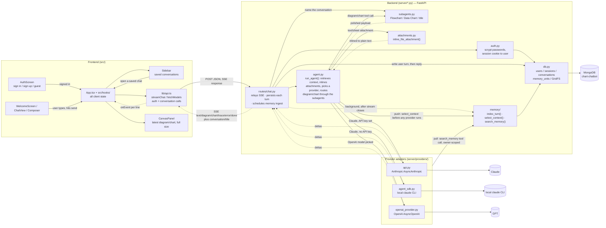
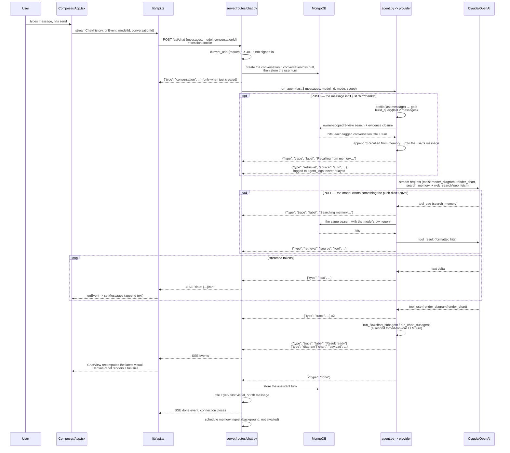
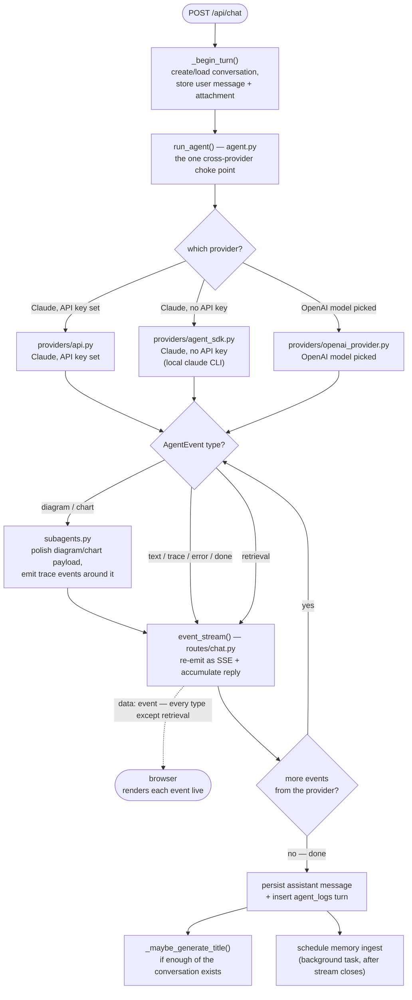
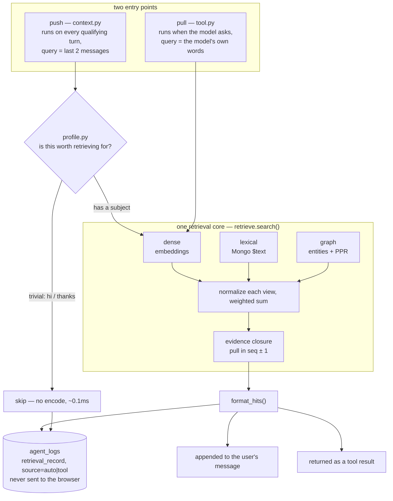
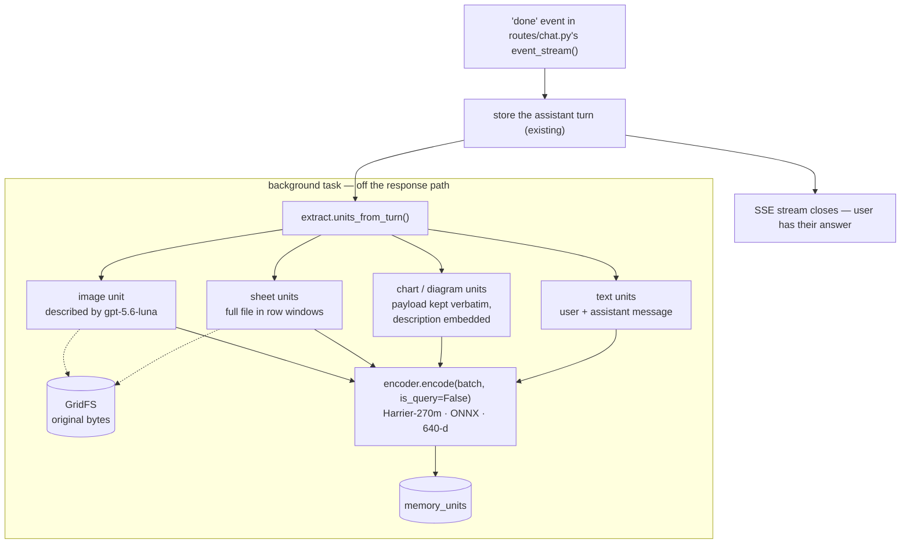

# How Diagrammer Works

**In one sentence:** you type a message, a language model answers it and may
call a "draw me a flowchart/chart" tool, and everything it does streams back to
the browser live.

One request = one round trip. React sends the chat history — plus an optional
image or text/Excel attachment — to a Python FastAPI backend, which asks an LLM
(Claude or OpenAI, picked per request), the LLM streams text and optionally
calls a `render_diagram`/`render_chart` tool, and the server relays every event
to the browser over SSE as it happens.

Generating that answer needs nothing but the request itself — the server keeps
no session state, and only the last three messages are replayed. Anything older
comes back through the memory layer, which is reached two ways: it retrieves
automatically before the model runs on any turn that looks like it has a
subject, and the model can also call `search_memory` itself. Two more things
happen around the turn: it is written to MongoDB as it streams, so a signed-in
user can reopen the conversation with its charts intact, and once the stream
closes it is indexed into memory for later retrieval.

---

## Start here

**If you read nothing else, read these seven files in this order.** Each one is
the caller of the next, so you can follow a single request all the way down:

1. **`src/App.tsx` + `src/hooks/`** — the client's state. `App.tsx` wires four
   hooks together and picks a screen; `useAuth` (session), `useConversations`
   (saved history), `useChatTurn` (the live turn, and the reducer that folds
   each `ServerEvent` into a message), `useComposer` (unsent draft +
   attachment).
2. **`src/lib/api.ts`** — the only place that talks to the network.
   `streamChat()` POSTs and hand-parses the SSE stream line by line.
3. **`server/routes/chat.py`** — `POST /api/chat`, all `async def`. Loops over
   `run_agent(...)`, re-emits what it yields as SSE, persists the turn around
   it, and schedules memory ingest. No LLM logic itself. (`server/main.py` is
   app construction only; the other routes are its siblings in
   `server/routes/`.)
4. **`server/agent.py`** — `run_agent()` trims history to the last 3 messages,
   inlines attachments, looks up the model, forwards the memory `Scope`, hands
   off to one of `server/providers/`, and intercepts `diagram`/`chart` events on
   the way out.
5. **`server/providers/{api,agent_sdk,openai_provider}.py`** — one file per
   transport, each independently readable, all yielding the same `AgentEvent`.
   Each answers `search_memory` in its own tool loop.
6. **`server/subagents.py`** — the quality pass, called only from `agent.py`.
7. **`server/memory/`** — read `__init__.py` first; it names the five public
   functions (plus `memory_enabled()` and the `Scope` type, which the chat
   route and `agent.py` import directly) and maps the other twelve files.

**To run it** (see `CLAUDE.md` for why every command goes through conda):

```bash
conda activate ui-design
npm run dev                  # Vite :5173 + FastAPI :8787
```

Frontend-only work needs no backend or sign-in at all —
`http://localhost:5173/?demo=1` renders a pre-seeded chat from
`src/lib/demoData.ts`.

On a checkout whose database predates the entity graph, run the backfill once —
it is idempotent, so a second run does nothing:

```bash
python -m server.memory.backfill     # entities, edges, and any vec: null units
```

**To check you didn't break anything:**

```bash
npm run lint && npm run typecheck
python -c "import server.main"       # no Python typechecker is configured
python -m server.memory.demo         # the merge gate: tenant isolation
```

`demo.py` runs the other modules' self-checks too, so it is the one command to
remember rather than one of six.

### Vocabulary

The words below mean something specific in this codebase. They come up
constantly and most of them are not standard terms.

| Term | What it means here |
|---|---|
| **Provider** / **transport** | One of the three interchangeable backends in `server/providers/`. They all yield the same events, so nothing above them knows which ran. |
| **`AgentEvent`** | The one dict shape that crosses every boundary: `text`, `diagram`, `chart`, `trace`, `retrieval`, `error`, `done`. Produced by a provider, relayed by `routes/chat.py`, consumed by `useChatTurn`. |
| **Choke point** | A single function every path must pass through, where cross-cutting work lives instead of being repeated. `run_agent()` is the one for generation, `routes/chat.py` for persistence. |
| **Subagent** | A second, narrower LLM call that polishes a tool payload before it's rendered (`server/subagents.py`). The user never sees it directly. |
| **Draw mode** | The composer's Auto / Flowchart / Data Chart selector. It changes *which tools the model is offered*, nothing else. |
| **Memory unit** | One indexed piece of a past turn — a message, a chart payload, a window of spreadsheet rows, an image description. Rows in `memory_units`. |
| **`Scope`** | The per-request tenant boundary (`server/memory/types.py`). Every memory function takes one, and it can't be built without an owner id. |
| **Push / pull** | The two entry points into retrieval. **Push** runs automatically before the model sees the turn (`memory/context.py`); **pull** is the model calling `search_memory`. Same core, same log record, told apart by a `source` field. |
| **View** | One ranking signal over the same units. Three exist — dense (embeddings), lexical (Mongo `$text`), graph — and their scores are normalized separately then summed. |
| **Entity graph** | Strings a unit is *about* (`memory/entities.py`), linked when observed together (`memory_edges`) and walked with Personalized PageRank. It's how a query reaches a unit that shares none of its words. |
| **Evidence closure** | Pulling in the units immediately before and after a hit. "Change the colour to blue" means nothing without the turn that named the diagram. |
| **The gate** | The cheap deterministic check (`memory/profile.py`) that decides whether a turn is worth retrieving for. "hi" isn't. |
| **`trace` vs `retrieval`** | `trace` is a status line the user sees ("Recalling from memory…"). `retrieval` is the structured record of what a search returned — logged to the database, never sent to the browser. |
| **Terminal tool** | A tool whose result the model never reads (`render_diagram`, `render_chart`) — the provider answers it with a fixed string. `search_memory` is the opposite, and that difference shapes a lot of the code. |

---

## Big picture



## One chat turn, in order



## The same turn, as backend steps

1. `POST /api/chat` (`server/routes/chat.py`) validates the model/key, then
   `event_stream()` calls `_begin_turn()` — creates or loads the conversation
   and writes the user's message.
2. `event_stream()` loops `async for event in run_agent(...)`. `run_agent()`
   (`server/agent.py`) is the one cross-provider choke point: it retrieves
   memory for the turn (`select_context`, before attachment inlining so the
   query is the question rather than a spreadsheet), inlines any file
   attachment, appends the recalled evidence to the last user message, resolves
   the model catalog entry, and dispatches to exactly one of
   `server/providers/{api,agent_sdk,openai_provider}.py`, each streaming the
   same `AgentEvent` shape.
3. Still inside `run_agent()`: a `diagram` or `chart` event is intercepted
   before it reaches the chat route and run through a second, specialized subagent
   call (`server/subagents.py`) that polishes the payload — bracketed by
   synthesized `trace` events ("Active agent: …", "Calling render_… tool…",
   "Result ready") so the client sees live progress. Every other event type
   passes through untouched.
4. Back in `event_stream()`, each event is re-emitted as SSE *and* accumulated:
   `text` appends to the reply, `diagram`/`chart` to the reply's payload lists,
   `trace` to `reply["trace"]`. The exception is `retrieval`, which is appended
   to the turn's `agent_logs` steps and then `continue`d past the SSE yield —
   the one event that is recorded but not relayed. On `done`, the assistant
   message is written, a title may be generated, and memory ingest is scheduled.



**Logging is not `agent.py`'s job.** `agent.py` has no per-request identity —
it's shared by three providers and knows nothing about which conversation or
user it's serving. `conversation_id`/`ownerId` only exist one level up, in
`event_stream()`, which is why step-logging hooks in there instead of at the
choke point.

### Persisted agent-step log

Beyond the `ProcessTrace` box, every turn's steps are written to a durable
`agent_logs` collection (`server/db.py`) — one document per turn:
`{ownerId, conversationId, startedAt, endedAt, status: "done" | "error", steps}`.
`event_stream()` appends a step for each `trace` event (the same phases the UI
shows) plus a terminal `done`/`error` step, then inserts the document once the
turn ends. Trace-level, not every raw provider event — no text deltas, no
tool_use blocks.

**One step type goes further than the UI, in both directions.** A `retrieval`
step is richer than a label — `{type, label, query, status, list_result, at}`,
where `list_result` holds one structured record per hit — and it is the only one
the browser never receives. So the log is a superset of the trace, not a copy:
this is where you look to see what a memory search actually returned.

Read it back via `GET /api/conversations/{id}/logs`, owner-scoped through the
same `_owned_conversation()` check as the other conversation routes, newest turn
first.

---

## The subagent pass: Flowchart Agent / Data Chart Agent

`run_agent()` sits between every provider and the SSE relay, so it's the one
place that can intercept a `diagram`/`chart` event regardless of which provider
produced it. When it sees one it awaits a second, specialized, forced-tool-call
LLM turn (`server/subagents.py`) before forwarding:

- **Flowchart Agent** turns the rough `render_diagram` intent into Mermaid
  source via `emit_mermaid_flowchart` (`{title, mermaid}`). It owns structure,
  labels, and whether the diagram uses Mermaid's `handDrawn` look. Node
  *positions* are Mermaid's own layout engine's problem.
- **Data Chart Agent** turns the rough `render_chart` intent into a full
  ECharts `option` — whichever form fits the data (scatter, radar, funnel,
  gauge, heatmap, candlestick, sunburst…), capped at 8 categorical slices
  (extras fold into "Other", per the `dataviz` skill) — but is told never to set
  `color`. `ChartCard.tsx` picks the ramp from the option's own structure.
  `tools.py`'s `render_chart` description tells the *primary* model about this
  full range too, or it wrongly tells users a chart type "isn't supported".

Both fall back to a deterministic Python mapping if no subagent LLM client is
configured (`_fallback_mermaid_flowchart`, `_fallback_chart_option`), so the app
works end-to-end with zero setup.

## Flowchart rendering: Mermaid

`DiagramCard.tsx` calls `mermaid.render()` client-side. Color follows the same
principle as charts — the subagent never emits literal colors — but the
mechanism differs because Mermaid has no `option.color` hook: `DiagramCard.tsx`
*appends* a fixed `classDef` header (one rule per node kind, built from
`palette.ts`). Appending rather than prepending means it never has to reason
about where an optional YAML frontmatter block ends.

**Per-node colors, when the user asked for them.** The primary model can set a
node's `color` in the `render_diagram` call — for "make the blocks match the
colors in this image", say. `agent.py`'s `_node_colors()` lifts those off the
intent into a `colors` map on the payload (hex only, and only for ids that are
bare Mermaid identifiers — see below), and `buildColorOverrides()` turns each
into a `classDef ncolorN` plus a `class <id> ncolorN` statement appended *after*
the kind header. The node ends up carrying both classes
(`class="node default process ncolor0"`) and CSS source order decides, so the
override wins — measured in a real render, in both looks, not assumed from the
docs. A later `class <id> <name>` statement therefore beats an earlier `:::kind`
tag, which is the whole reason appending is enough. Label ink is picked from the
fill's relative luminance.

This deliberately does not travel as Mermaid `style` lines from the subagent:
the same color needs a different declaration per look (hand-drawn must restate
`SKETCH_STROKE_WIDTH`, classic must not) and the hand-drawn toggle is client
state the server can't see. Sending `{id: color}` and letting the client compile
it keeps one color correct in four combinations of look and theme.

**Hand-drawn look is a client-side toggle.** The card header's switch fully owns
the `look: handDrawn` frontmatter — it strips whatever the subagent decided
(`stripLookFrontmatter()`) and re-adds it only when on. Per-diagram frontmatter
overrides the site default, so the switch always wins. It resets to the
subagent's decision when a *new* diagram arrives (`useEffect` keyed on
`diagram.mermaid`), so manual toggling can't fight itself across turns.

Five gotchas, all found by breaking them live:

- **`class "weird id" ncolor0` is a parse error that kills the whole diagram**,
  whereas `class anIdThatDoesntExist ncolor0` renders fine and is ignored (no
  ghost node). Node ids come from the model, so `_node_colors()` drops any id
  that isn't `[A-Za-z][A-Za-z0-9_]*` — a lost color beats a lost diagram.
- **A semicolon in label/edge text silently breaks the whole diagram** —
  Mermaid treats `;` as a statement terminator.
- **The bare word `end` is reserved** and breaks parsing as a class name *or* a
  node id. The prompt tells the subagent both to preserve node ids exactly and
  to avoid `end`, which conflict whenever the primary model names its end node
  `end` — so the real fix is a code backstop, `_rename_reserved_end()`, applied
  to every output including the fallback.
- **`htmlLabels: false` is required.** Mermaid's `<foreignObject>` labels taint
  any canvas the SVG is drawn onto, breaking Copy/Download with "Tainted
  canvases may not be exported".
- **Hand-drawn's solid fill depends on a magic constant.** Mermaid hardcodes
  `fillStyle: "hachure"`, so a "fill" is really parallel diagonal strokes (4px
  wide on a 5.2px gap). A `classDef` compiles to CSS with `!important` on every
  `<path>`, overriding rough's own line width — so pushing
  `SKETCH_STROKE_WIDTH` past the gap makes adjacent strokes overlap into solid
  color. It's `7px`. **Under ~5.2px the diagonal striping returns** — recognize
  the symptom. The same width thickens the outline, which is why each node kind
  uses one color for both `fill` and `stroke`.

There is no server-side flowchart validator (`@mermaid-js/parser` covers only
newer diagram types with a real grammar), so `DiagramCard.tsx` wraps
`mermaid.render()` in a try/catch with a fallback UI, and the prompt rules above
are the closest available substitute.

## Draw-mode selector: Auto / Flowchart / Data Chart

The composer's mode popover restricts *which tool the primary model is offered*,
not a forced tool call. `ChatRequestBody.mode` flows from the chat route through
`agent.py` into whichever provider ran, and each asks
`tools_for_mode(mode, memory=...)` for its tool list: `"auto"` gets both drawing
tools, `"diagram"`/`"chart"` get one. A hard `tool_choice` force was deliberately
avoided — it would make the model call a tool on *every* message, so a plain
"hi" in Flowchart mode would draw an empty diagram. Subagent dispatch already
keys off which event fired, so this restricts the subagent too, for free.

`search_memory` survives every mode, because it isn't a drawing tool and a
locked mode is exactly when recall matters most — "redraw last week's chart with
this year's numbers" is a chart-mode request that can't be answered without it.

## Theming: light / dark / system

Two kinds of consumer need to know the theme and they can't share one mechanism.
Tailwind's `dark:` utilities need a **class** on `<html>`; ECharts and Mermaid
need a **boolean in JS** to pick a palette. `src/lib/theme.ts` owns both, so they
can't disagree:

```
localStorage['diagrammer:theme']  →  'light' | 'dark' | 'system'
                                          │
                          theme.ts ───────┼──→ .dark class on <html>  →  every dark: utility
                                          ├──→ documentElement.style.colorScheme
                                          └──→ useIsDark()  →  ChartCard, DiagramCard
```

- **`index.css` repoints the variant.** One line —
  `@custom-variant dark (&:where(.dark, .dark *))` — switches every existing
  `dark:` utility from Tailwind v4's default `@media (prefers-color-scheme:
  dark)` to that class. Nothing else in the ~190 styled elements changed when the
  picker was added.
- **`index.html` sets the class before first paint.** React mounts *after* the
  first paint, so a theme applied from a component — even in a `useState`
  initializer — flashes the wrong one on every reload. Six lines of inline
  `<script>` read the same localStorage key and set the same two properties. It
  is a deliberate duplicate of `theme.ts`'s `apply()`; keep them mirrored.
- **The store lives outside React**, behind `useSyncExternalStore`. The two
  components that consume the boolean are memo'd leaves at the bottom of the
  tree; passing the theme down as a prop would re-render them on every parent
  render, which is exactly what the memo exists to prevent. No context provider,
  no new dependency.
- **`system` is the default and still live-follows the OS.** A `matchMedia`
  listener re-applies on an OS change, but only while `system` is selected — an
  explicit light or dark pick must survive the user's OS flipping under it.
- **Chart and diagram colors needed no per-theme code of their own.** They
  already read `useIsDark()` and index into `palette.ts`'s light/dark arrays
  (`CATEGORICAL_*`, `SEQUENTIAL_*`, `CARD_SURFACE`), and pass `theme: 'dark'` to
  ECharts and Mermaid for the axis/grid/edge chrome those libraries own. Adding
  the picker changed which value the hook returns, not what anything does with
  it. `colorScheme` on `<html>` covers the last surface neither library nor
  Tailwind reaches: native scrollbars and native form controls.

### The surface ladder

There is **one gray ramp, `stone`, in both themes** — light mode used the cool
`neutral` ramp until the light redesign, which is what made it read as washed
out next to the warm dark theme. Every surface is a step on one ladder, and
they only work as a set:

| Step | Light | Dark | Who owns it |
|---|---|---|---|
| ground | `stone-200` | `black` | `App.tsx` — the tint the app card floats on |
| app card | `white` | `stone-900` | `App.tsx` — inset + rounded from `lg` up |
| rail | `stone-800` | `stone-950` | `Sidebar.tsx` |
| canvas ground | `stone-200/60` | `stone-950` | `CanvasPanel.tsx` |
| chart/diagram card | `white` | `stone-900` | `ChartCard` / `DiagramCard` |

Two constraints on that ladder, both easy to undo by accident:

- **The chart card stays pure white.** It's the last step for a reason — a
  chart's own `CATEGORICAL_LIGHT` series are the most saturated thing on the
  page and need the cleanest ground under them, and `CARD_SURFACE.light =
  '#ffffff'` is what `getDataUrl()` bakes into an exported PNG. Tinting that
  surface would put a tint in every downloaded chart. This is also why the
  ground is a low-chroma warm gray and not a colored wash.
- **The app is a fixed-height card, not a scrolling page.** `App.tsx` is
  `h-svh overflow-hidden` and every screen inside it is `h-full min-h-0` with
  its own scroll container. A new screen that reaches for `min-h-svh` will
  overflow the card instead of scrolling inside it.

The **rail is dark in both themes** — it's the one high-contrast surface, and
in light mode it's what gives the white content area an edge to sit against.
That's why `Sidebar.tsx` styles itself with white/alpha overlays rather than the
`dark:` pairs every other component uses: its background is dark either way, so
a second set of variants would say nothing.

## Attachments: Image / Text / Sheet

**Images** go to each provider's multimodal content blocks — on **every** user
message that carries one, not just the last. `toOutgoing()` resends an image on
each turn and `HISTORY_LEN` keeps it in the window, but both provider converters
used to attach it only at `i == last_index`, a condition written when only the
opening turn could have one. The symptom was a follow-up about an uploaded
picture ("make the blocks match its colors") answered by a model that had been
handed only that message's text. `HISTORY_LEN` caps how many images arrive at
once. Remaining gap: after a page reload the client holds a display-only
`attachment` reference and sends `image: null`, so the picture is gone until the
GridFS blob is re-inlined server-side.

**Text and Sheet** (`.xlsx`/`.csv`) share one wire field,
`ChatRequestMessage.file`, and one choke point — `attachments.py`'s
`inline_file_attachment()`, called from `agent.py` before any provider runs. It
decodes to text for `text/plain` and `text/csv`, or parses the first sheet with
`openpyxl` into a markdown table (capped at `MAX_ROWS`) for xlsx. By the time a
provider runs it's already ordinary text.

**`_decode_text()` sniffs the encoding rather than assuming UTF-8, and that's
load-bearing.** Excel on Windows writes plain "CSV" in the *system ANSI
codepage* — cp1258 on a Vietnamese locale, cp1252 on a Western one — and
"Unicode Text" writes UTF-16; only "CSV UTF-8" writes UTF-8, with a BOM. So it
checks for a UTF-16 BOM first (a bare `decode("utf-16")` with no BOM guesses
little-endian and silently succeeds on Latin text, which is why it can't just be
another rung), then tries `utf-8-sig` → `cp1258` → `cp1252` strictly, and only
then falls back to lossy `errors="replace"`. Every result is
`unicodedata.normalize("NFC", ...)`d, because cp1258 can't encode a precomposed
`ỏ`/`ố` at all — it stores base letter + combining tone mark, which renders
correctly but won't string-compare or slugify.

This is the one place in the backend where text could be lost, and it was:
attaching a Vietnamese CSV used to turn every accented character into `U+FFFD`
(`TEU kh□ng h□ng`) *before the LLM saw it*, so the chart faithfully rendered
mojibake. **One box per accented character means the text was destroyed
upstream; it is never a missing font**, since `à`/`á`/`ã` exist in every font
ever shipped. `python -m server.attachments` covers all four encodings.

An attached image's thumbnail is clickable — `ImageLightbox.tsx`, mounted via
`createPortal(..., document.body)` because `ChatView`'s `overflow` ancestors
would clip a `position: fixed` descendant.

## Split-pane canvas + cross-turn edits

`ChatView.tsx` computes the single latest diagram/chart across the conversation
(`findLatestVisual`). Before one exists, chat is one centered column; after,
`CanvasPanel.tsx` renders it full-size on the left and the message list narrows
on the right. `MessageBubble.tsx` shows a small "see canvas" note instead of an
inline card.

For a follow-up to *revise* what's on canvas, the model has to see what it drew
— but `toOutgoing()` only replayed `text`. `withVisualContext()` appends a
compact JSON block (`[Previously rendered chart: {...}]`) to that message's
replayed text. That's the whole mechanism: no "edit" tool, no special mode.

## Process Trace

`agent.py` emits `{"type": "trace", "label": str}` around a subagent call —
which subagent activated, its forced tool call, its result. Three real phases,
not fabricated steps. It emits one more before the provider even starts,
`"Recalling from memory…"`, when the push path retrieved something; all three
providers emit their own for web searches and for `search_memory`, so a
searching turn shows "Searching the web…" or "Searching memory…" through the
same box. A turn where the gate skipped retrieval shows nothing — it is logged,
but there was no work to watch, and inventing a step for it is exactly the
fabricated progress this box exists without.

**Status lines only.** What a memory search actually *returned* does not come
through here — that's a `retrieval` event, filed into `agent_logs` and never
relayed (see "The memory layer"). The box is for what the turn is doing, not for
retrieval internals.

`ProcessTrace.tsx` stays mounted after the turn — spinner becomes a check and
the list collapses itself, with a manual click still winning from then on. It
used to render only while `isStreaming && !text` and disappear the instant the
reply began; keeping it costs one collapsed row and answers "did this turn
search anything?" after the fact. The chat route persists `reply["trace"]`, so the
labels survive a reload too.

## The memory layer

`server/memory/` indexes what happened so it can be retrieved later, and gets it
back in front of the model. Phases 1–3 of `DISCUSS_RAG.md`:

- **Write** — `index_turn()` runs as a background task once the SSE stream has
  closed, so encoding and the image-description call never sit in front of a
  response.
- **Read, pushed** — `select_context()` runs on every turn that clears a cheap
  gate, before any provider does, and appends what it found to the user's
  message.
- **Read, pulled** — `search_memory` is a real tool the model can call for
  something the push didn't cover.

Together these are what make `agent.py`'s `HISTORY_LEN = 3` truncation safe
instead of lossy: the last three messages are in context, and everything older —
other conversations, and the *full* contents of attachments rather than the
truncated copy inlined into the prompt — is either already attached to the turn
or one tool call away.

### Why both, when the tool already existed

Pull alone has a hole that isn't the model's fault. To decide it should search,
the model has to first notice something is missing — and the whole problem with
a truncated history is that what was truncated leaves no trace in what remains.
A question that needed the warehouse study from three weeks ago looks, from
inside a three-message window, exactly like a question that didn't.

So retrieval also runs unprompted. Both paths call the same `search()`, format
with the same `format_hits()`, and write the same `retrieval_record()` — the
only difference recorded anywhere is a `source` field of `"auto"` or `"tool"`.
That field is worth more than it looks: a turn that retrieved automatically *and
then* had the model search anyway means either the automatic query was wrong or
the model didn't notice what it was given, and neither is visible without it.



### The gate, and the two strings

Auto-retrieval costs an encode plus a vector
scan (~145ms) in front of a waiting user, and `"hi"` has nothing to retrieve
for. `profile.py` skips greetings, acknowledgements and anything too short to
carry a subject, at a cost of ~0.1ms. The part that is easy to get backwards:

- the **gate** reads only the message just sent — profile the pair and a `"hi"`
  following a long assistant reply looks substantial, so the gate never fires;
- the **query** is the last *two* messages — query on one and every bare
  follow-up loses its subject, because "change the colour to blue" is a sentence
  whose object is in the turn before it.

**Where the evidence goes.** Appended to the last user message, in a bracketed
block that says what it is — never a system message, and never disguised as
something the user typed. The placement is also what keeps prompt caching viable
later (`DISCUSS_RAG.md` §10): retrieved evidence changes every turn, so it has
to sit *behind* everything stable or it invalidates the cached prefix each time.
That is the mirror image of attachment inlining, which is *pre*pended because it
is stable for the turn.



### The write path: store the original, never a summary

The guiding rule is Zero-Mem's
and it's the opposite of most memory systems: store the original, never a
summary. A chart payload already holds its exact title, series names and numbers
— paraphrasing it would throw away the very thing a follow-up needs. So a chart
unit keeps the raw payload verbatim, and the text that gets *embedded* is only a
retrieval handle. Images are the deliberate exception: there's no text in an
image to keep, so a vision model writes a description at ingest and that is what
gets embedded. It's the one generative call in the whole memory path, it happens
after the response is sent, and if it fails the image is still stored — just not
searchable by content.

**A truncation limit belongs to its consumer.** `attachments.py`'s
`MAX_ROWS = 300` is a *prompt* budget — it stops an attachment crowding out the
conversation — and it has no business binding what gets remembered.
`sheet_row_windows()` therefore chunks the *whole* sheet into overlapping
windows, each repeating the header so a chunk read alone still has column names.
A live test made the point better than the reasoning did: on a 420-row sheet the
assistant answered "300 regions" from the truncated prompt while memory held all
420.

### Retrieval: three views, fused

`retrieve.search()` runs them all, min-max
normalizes each view's scores independently, then takes a weighted sum.
Normalizing per view is what makes the sum mean anything — a `$text` score, a
cosine similarity and a PageRank mass aren't remotely on the same scale.

| View | Finds | Misses |
|---|---|---|
| **dense** (Harrier embeddings, `store.dense()`) | Paraphrase, cross-language matches — "how much did we earn" finding "revenue" | Exact strings it has no reason to weight |
| **lexical** (Mongo `$text`) | Names, dates, numbers, product codes, quoted phrases | Anything worded differently |
| **graph** (`graph.py`) | Units sharing *no* words and no meaning with the query, reached through an entity two hops away | Anything not tied to an extracted entity |

A unit several views agree on outranks one that a single view found, which is
the behaviour that makes this better than any one of them.

**The graph view, concretely.** `entities.py` extracts what a unit is about —
tickers, amounts, dates, quoted titles, and ordinary content words to fill the
budget — and `memory_edges` links any two seen together. At query time the same
extractor runs over the query, `graph.load_adjacency()` pulls a bounded two-hop
neighbourhood, and Personalized PageRank spreads activation from the query's own
entities across it; units are then scored by the activated entities they carry.
No `networkx`: this is a textbook power iteration over a dict-of-dicts on a
graph of hundreds of nodes.

There is **no NER model**, and that isn't a shortcut. `en_core_web_sm` is
English-only and fails outright on the Vietnamese this app is used in, and a
multilingual one is a dependency, a download, and a forward pass per unit at
ingest. What replaces it fits better than it sounds: the graph records *observed
co-occurrence*, not inferred semantics, so precision matters far less than for a
knowledge graph — and what these units actually contain is exactly the category
regex handles best and NER handles worst.

**Evidence closure.** After fusion, the units immediately before and after the
top few hits get pulled in even though they matched nothing, flagged
`is_context` with a score of 0 and labelled as such in what the model reads. A
hit is one message out of a conversation, and some messages have their subject
in the one before them. They're appended after the real hits rather than ranked
among them, so nothing about the ranking changes — and the model is told they
didn't match, because a model told these are results will cite them as answers.

**What's still a seam rather than a feature.** `_fuse()` takes a list of named
views, so a fourth is one more entry. `weights` is a parameter —
`search(..., weights=...)` — so Zero-Mem's query-dependent `Route(q)` is a
change to what goes *in*, not to anything below. It defaults to a fixed dense
0.5 / lexical 0.3 / graph 0.2 that nothing computes and nothing has measured.
The instrument for fixing that already runs: `viewScores` on every hit of every
logged retrieval says what each view actually contributed.

### The read path: `search_memory`

The model calls it with one field, a query
string. `memory/tool.py` runs the search and renders the hits as text, because
text is the only shape all three transports agree on — an Anthropic
`tool_result`, an OpenAI `function_call_output` and an MCP text block are three
envelopes around the same string. Each hit is labelled before its content:

```
[1] "Q3 revenue review" · turn 14 · assistant · 2026-08-03 · chart
Bar chart "Revenue by region" — x axis: region; series: revenue, cost.
data: {"title":"Revenue by region","chartType":"bar",…}
```

The label is the point. A model handed bare text has no way to say where it
learned something, so it either omits the source or invents one; handed a
conversation title and turn number it writes "in 'Q3 review', turn 14" and the
user can go check. `kind` is there so a partial source announces itself — a
`sheet` hit is one window of a bigger file, and the model should know that. For
chart and diagram hits the **raw payload** rides along as compact JSON, since the
exact numbers are the whole reason `extract.py` stores it verbatim next to the
prose.

Two rules the formatter follows, both from the consumer being a model rather
than a screen. **Never return an empty string** — a blank tool result reads as a
malfunction and gets retried with reworded queries, so "no matches" is spelled
out as a sentence. And **budget the output**: a sheet window is a hundred-row
markdown table, and ten returned verbatim would cost more context than the
truncated history the tool exists to compensate for. How many come back is
`MEMORY_SEARCH_LIMIT`, default 10, read per call and clamped.

**What came back is logged, not displayed.** `retrieval_record()` builds one
entry per search — the query, a status, and a `list_result` array with each hit's
rank, conversation, ids, `seq`/`role`/`kind`, score, `viewScores` and a capped
text preview. Each provider yields it as a `retrieval` event and the chat route files
it into `agent_logs.steps`, then `continue`s **before** the SSE yield: it is the
one provider event the browser never sees. The chat UI gets the
`Searching memory…` status line and nothing else.

Two details worth knowing before touching it. `viewScores` is the field that
earns the structure — it says why a hit ranked where it did, and a view missing
from the dict returned nothing at all for that query. And **ids are stringified
at construction**, because `GET /api/conversations/{id}/logs` hands `steps`
straight to FastAPI's encoder, which handles `datetime` but raises on
`ObjectId`; a raw id would break only that route, and only once someone read a
log. `run_search_memory` takes the list as a *sink* rather than returning it,
because `agent_sdk.py`'s MCP handler can't yield at all — it only shares a
closure with its provider loop, which drains the list as messages arrive.

It first shipped as one `trace` event per hit. That reused an existing pipe at
the cost of the thing itself: a search *is* one event containing a list, and
flattening it put retrieval internals in front of the user *and* turned one
search into seven sibling rows in the log, each with the interesting part
crammed into a truncated string.

**A retrieval tool isn't shaped like this app's other tools.**
`render_diagram`/`render_chart` are *terminal* — the provider yields an event and
answers the model with `"Rendered to the user."`. `search_memory` feeds real
content back into the loop and needs per-request identity. Two consequences:

- It **can't** be intercepted at `agent.py`'s choke point the way diagram/chart
  events are, because a tool result has to be answered inside each provider's
  own loop. `agent.py` forwards the `Scope` instead of handling the tool.
- In `agent_sdk.py` the MCP server is built **per request**. An MCP handler
  receives only the tool's arguments — there is no context parameter — so the
  only way to give it an owner is a closure, and a closure over a per-request
  value can't live in a module-level server. A `ContextVar` would work until a
  handler ran on a different task than the one that set it, and would fail by
  searching the wrong person's memory rather than by raising.

**The scope is the entire security boundary.** `search_memory`'s schema has one
field. There is no owner or conversation parameter, so the model cannot widen
what it sees and a prompt injection inside a retrieved document has nothing to
aim at. The `Scope` comes from the session cookie via `routes/chat.py`'s
`_memory_scope()`, which returns `None` when `MEMORY_ENABLED=0` — and `None`
removes the tool and its prompt text entirely, leaving a request byte-identical
to what the app sent before any of this existed.

### Tenant isolation is structural, not remembered

Every function in `store.py`
takes a `Scope` first, `Scope` can't be constructed without an owner id, and
nothing accepts a raw Mongo filter. Dense scoring filters *before* loading
vectors rather than after ranking. This is the highest-severity bug class in a
retrieval system: a missing owner filter raises nothing, logs nothing, passes
every test written with one user, and puts someone else's private conversation
into a prompt.

**The graph made that harder, not easier.** Every other query filters `ownerId`
once, at the leaf. A walk hops unit → entity → unit — and entity strings are
inherently *global*: "warehouse" is a legitimate node in every account's graph,
so nothing about the string distinguishes one person's subgraph from another's.
The structural answer is that `graph.load_adjacency()` pulls the whole
neighbourhood up front through `store.neighbours()`, which is owner-filtered,
and the walk then runs over that dict — it never queries mid-traversal, so it
cannot leave the tenant however many hops it takes.

`python -m server.memory.demo` is the merge gate. It seeds two users with
near-identical text *and a deliberately shared entity*, gives each one a private
entity nobody else has, and asserts from both directions that the private one is
never reachable — through `neighbours()`, the PPR walk, `units_by_entities()`,
evidence closure, `select_context()`'s prompt output, or the `agent_logs`
record. Assertions compare ids and titles, never text, because the seeded users
say the same thing on purpose.

### Ceilings, provenance, and what nobody has measured

**Embedding provenance is recorded on every unit.** `embedModel`, `embedDim` and
`embedSpace` are written but nothing reads them yet. They exist because a vector
only means anything relative to the model that produced it: swap encoders
without recording which one ran and every stored vector silently becomes noise
against new queries — no error, just worse results nobody attributes to the
change. `store.dense()` filters on them, so mixing spaces is impossible rather
than merely discouraged.

**Cost ceilings, stated.** Dense scoring is a brute-force dot product over one
owner's vectors in this process — MongoDB Community has no `$vectorSearch`.
Because every query is owner-scoped, cost tracks one user's history depth, not
the user count. Roughly fine to ~10k units per user (~25MB of float32 at 640
dims); past that, a real vector index goes behind the same `store.dense()`
signature.

A warm search is ~145ms — one query encode plus the scan — and unlike ingest it
*is* on the response path, now on every turn that clears the gate rather than
only when the model chose to search. The **cold** number is the one that bites:
the encoder loads lazily and that first load is ~4s, which would land on the
first turn after every boot and `--reload`, reliably enough to trip
`context.TIMEOUT_SECONDS` and answer that turn with no memory at all. `main.py`'s `lifespan`
schedules a warm-up at startup so nobody's first question pays for it.

Edges are pairwise, so their write cost is quadratic in entities per unit. Hence
the caps: 24 entities stored per unit, top 12 linked, top 6 for cross-unit
adjacency, and `sheet` units extract from their header only — one uncapped
100-row spreadsheet window is tens of thousands of edges.

**There is no relevance floor, and that is deliberate.** Cosine similarity
always has a nearest neighbour, so an unrelated query still returns this owner's
top-ranked units rather than nothing. No threshold is applied, because picking
one without an evaluation set is guessing — `DISCUSS_RAG.md` builds that set in a
later phase. The mitigation is in the prompt: the model is told results always
come back filled and to judge each one rather than stretch it to fit. The
self-check pins the behaviour so nobody rediscovers it as a bug.

## Live web search

Nothing in this repo implements searching — no API key, no HTTP client, no
summarize step. It's a provider capability that was turned on and prompted for.

| Transport | Tools | Runs where |
| --- | --- | --- |
| `api.py` | `web_search_20260209`, `web_fetch_20260209` | Anthropic's servers; results come back inline, no handler here |
| `agent_sdk.py` | `WebSearch`, `WebFetch` | The local `claude` CLI subprocess |
| `openai_provider.py` | `{"type": "web_search"}` | OpenAI's servers, via the Responses API |

`web_search` is the Google-shaped one; `web_fetch` (Claude only) opens a single
page. Search finds the page, fetch reads the numbers off it. **Searching is not
just for answering** — `WEB_TOOLS_PROMPT` also covers drawing: a chart whose data
the model lacks gets searched for rather than handed back to the user, and the
model is told to leave out what it can't source and say which points it
approximated.

**Why the OpenAI provider is on the Responses API.** On Chat Completions, web
search and function calling are mutually exclusive — measured, not assumed:
`gpt-4o` rejects `web_search_options`, `gpt-4o-search-preview` rejects `tools`,
`gpt-5.6-luna` calls the parameter unknown. Giving up `tools` would mean giving
up `render_diagram`/`render_chart`. It was briefly documented as "OpenAI
genuinely can't search" — that was wrong, and testing one API surface then
generalizing to the vendor is the mistake to avoid.

Two latent bugs in `api.py` surfaced when server tools landed:
`_serialize_assistant_content` enumerated the block types it knew (`text`,
`tool_use`) and dropped the rest, losing `server_tool_use` /
`web_search_tool_result` on replay — fixed by
`[b.model_dump(exclude_none=True) for b in blocks]`, which deleted more than it
added. And `stop_reason == "pause_turn"` (a server tool hitting the API's
internal iteration limit) fell into the "we're done" branch and truncated the
answer; it now re-sends the conversation as-is.

## Accounts and stored history

One MongoDB database, `chart-chatbot` (`server/db.py`):

```
users          { _id, userId, passwordHash, guest?, createdAt }
sessions       { _id, token, ownerId, expiresAt }   # TTL index on expiresAt
conversations  { _id, ownerId, title, titleLocked, createdAt, updatedAt,
                 messages: [ { role, text, diagrams, charts, trace,
                               attachment, at } ] }
memory_units   { _id, ownerId, conversationId, kind, role, text, seq, at,
                 payload, blobId, entities, vec, embedModel, embedDim, embedSpace }
memory_edges   { _id, ownerId, src, dst, weight, kind: "cooccur" | "adjacent" }
agent_logs     { _id, ownerId, conversationId, startedAt, endedAt, status,
                 steps: [ { type, label, at } ] }
attachments.*  # GridFS bucket: original bytes of an attached image or sheet
```

A message's `attachment` is `{ blobId, mediaType, kind: "image" | "file",
name? }` — a reference into the same GridFS `attachments` bucket the memory layer
uses (`server/memory/store.py`'s `save_blob()`/`load_blob()`), not the bytes
themselves. `routes/chat.py`'s `_stored_user_message()` uploads the blob when a turn's
last message carries an image/file, and `GET /api/conversations/{id}` turns the
reference into a fetchable `GET /api/attachments/{blobId}` URL (owner-checked
against the blob's own metadata) — so a reopened conversation shows what was
attached, without putting megabytes of base64 in the conversation document.

`userId` is the handle a person types; `ownerId` is the ObjectId foreign key
back to `users._id`. Messages are **embedded** in the conversation document
rather than kept in their own collection: one read reopens a whole conversation,
and the stored `diagrams`/`charts` are the same payloads the client renders, so
reopening redraws with no LLM call. `memory_units` *is* a separate collection,
for the opposite reasons — it's written asynchronously after a turn, queried
per-owner across conversations rather than per-conversation, and its vectors
would bloat a document that's read in full on every reopen.

**Sign-in** (`server/auth.py`) is a user ID and password hashed with stdlib
`hashlib.scrypt`. A successful login writes a `sessions` row and sets its token
as an httpOnly cookie; `current_user()` is the only place that cookie becomes a
user. Sessions are rows rather than JWTs specifically so signing out revokes
access immediately. "Continue as guest" creates an ordinary user row with a
generated `guest-xxxxxxxx` id and an empty `passwordHash` that
`verify_password()` can never match — every route works unchanged, and the
trade-off is that the account can't be signed back into once the cookie is gone.

**Saving happens inside `POST /api/chat`**, in `routes/chat.py`'s `event_stream()`. The
user's message is written on entry; the assistant's reply is buffered as events
stream past and written once on `done`. An errored turn writes no reply, which is
exactly what a retry expects to find. The subtle part is `_begin_turn()`, which
truncates the stored array to the client's history length *before* appending:
`handleRetry` re-sends a shorter history, and truncate-then-append makes the
stored array follow it instead of accumulating a duplicate of the turn being
retried.

**Deleting a conversation asks first.** `Sidebar.tsx`'s trash button opens a
native `<dialog>` naming the conversation rather than calling the handler; only
its Delete button reaches `App.tsx`'s `handleDeleteConversation`. `showModal()`
supplies the backdrop, Escape, focus trapping and top-layer stacking above the
sidebar's own `z-30`, so nothing about it is hand-rolled — the one thing it does
not supply is centering, because Tailwind's preflight zeroes the UA stylesheet's
`margin: auto` (hence the explicit `m-auto`). The confirm is purely a view
concern: the delete path below is unchanged.

**Deleting a conversation cascades** to its memory units and their GridFS blobs
(`memory.forget_conversation()`), its messages' own attachment blobs (the same
bucket, deleted directly by `delete_conversation()` since these aren't memory
units), and `agent_logs` — otherwise deleted content would stay retrievable,
which is both a correctness and a privacy bug.

Graph edges are the one thing **withdrawn rather than deleted**. They're
owner-scoped, not conversation-scoped, and the same entity pair may well have
been observed in conversations the user is keeping — so the delete regenerates
exactly the edges this conversation contributed (via the same `_edge_pairs()`
that wrote them, which is why one function produces both) and `$inc`s them down,
dropping whatever reaches zero. Deleting outright would tear holes in the graph
of surviving conversations; leaving the weight would keep a residue of deleted
content.

**Titles** come from a third subagent reusing the same `_call_subagent()`
helper, triggered by the first diagram/chart or the 6th message, then
`titleLocked` so the title never churns. If no subagent client is configured the
placeholder stays — a title is cosmetic and must never fail a turn.

---

## Cross-cutting patterns

These recur in several files, and getting one wrong shows up as a whole-app
problem rather than a local bug. Read them once you've followed a request end to
end; they'll make more sense with the flow in mind.

**One choke point per cross-cutting concern.** `agent.py`'s `run_agent()` is the
single place every provider's output passes through, so attachment inlining, the
subagent pass, and `trace` events live there rather than three times over. The
same instinct puts persistence and memory ingest in `routes/chat.py` (route concerns,
not generation concerns) and the tool list in `tools.py`. When a feature needs
*different* handling per provider — web search's tool definitions — that's the
signal it doesn't belong in a choke point.

**A choke point works on outputs, not on tool results.** Worth knowing before
adding a third tool: `run_agent()` can intercept a `diagram`/`chart` event
because those are *terminal* — the provider yields the event and answers the
model with a fixed string, so nothing has to flow back. A tool whose result the
model actually reads (`search_memory`) must be answered *inside* each provider's
own loop, so it cannot be centralized the same way. What `agent.py` centralizes
instead is the input: it forwards one `Scope`, and each provider handles the tool
in its own three-line branch.

**`async def` end to end, and what's allowed to block.** Every route runs on one
event loop, which is what lets one process serve many users. The rule is that
anything slow must be *awaitable* I/O, not CPU. Network calls (Claude, OpenAI,
MongoDB) and subprocess I/O (the `agent-sdk` CLI) already are.

**CPU-bound work goes through `asyncio.to_thread` with a semaphore.** The memory
encoder is the only genuinely CPU-bound thing here, and running it inline would
freeze every concurrent request for the length of a forward pass.
`memory/encoder.py` wraps each call in `asyncio.to_thread` — onnxruntime releases
the GIL, so the loop keeps running — behind
`asyncio.Semaphore(MEMORY_ENCODER_CONCURRENCY)` so N concurrent chats can't spawn
N inference threads. onnxruntime's own `intra_op_num_threads` is pinned to 2 for
the same reason: left at its default, `--workers 4` would have four processes
each sizing a thread pool to every core.

**Expensive clients are built lazily, under a lock.** Two places do this:
`openai_provider._get_client()` (the OpenAI SDK throws in its constructor when no
key is set, and this module is imported unconditionally) and
`memory/encoder._load()` (loading weights costs hundreds of MB of RSS and may
need a download first). Both use the double-checked pattern — check, take an
`asyncio.Lock`, check again — so two concurrent first-requests can't build two.

**Work that must outlive the response goes in a background task, with a strong
reference.** Memory indexing embeds several units and may call a vision model;
none of that belongs in front of a response the user is already reading, so
`routes/chat.py`'s `_spawn_memory_ingest` schedules it and returns (via `shared.spawn`). The non-obvious
part: **asyncio holds only a weak reference to a running task**, so a
fire-and-forget `create_task()` whose result nobody keeps can be garbage
collected mid-flight. `_ingest_tasks` is a module-level `set` each task discards
itself from on completion.

**Decide per dependency whether it degrades or fails.** Enrichment degrades, the
core fails loudly:

| Failure | Behaviour |
|---|---|
| Subagent LLM missing or erroring | Deterministic fallback payload; the chart still renders |
| Title subagent fails | Placeholder title stays; a title is cosmetic |
| Memory encoder unavailable | Unit stored with `vec: null`; dense retrieval skipped, lexical still works |
| Memory indexing throws | Logged, swallowed; the turn was already answered and stored |
| `search_memory` throws | Tool returns "memory is unavailable"; the model answers from context |
| MongoDB unreachable at startup | Server boots and prints why; `/api/health` stays green |
| MongoDB unreachable in a route | One app-wide handler returns 503 with a readable message |

**Nothing is shared across requests, so `--workers N` stays free.** Sessions live
in the database, not process memory; the Mongo client is a connection pool; the
only per-process state is the two lazily-built clients above, and both are caches
whose absence changes nothing but latency.

### Why the codebase is easy to track

- **One state owner.** `App.tsx` holds all mutable state; every other component
  is a pure props-in view.
- **One shape crosses every boundary.** The `AgentEvent`/`ServerEvent` dict
  (`text` | `diagram` | `chart` | `trace` | `retrieval` | `error` | `done`, plus
  `conversation` | `title` from `routes/chat.py`) is produced by a provider, forwarded
  verbatim, and consumed verbatim by `App.tsx`'s reducer. Grep for that shape and
  you've found every place a chat event is created or handled.
- **Almost no hidden state.** No router, no global store. The database holds
  accounts, conversations and memory, and answering a request reads from it in
  exactly two places — the automatic `select_context()` at the top of
  `run_agent()`, and a `search_memory` tool call inside a provider's loop. Both
  announce themselves in the trace, and both write a `retrieval` record to
  `agent_logs` saying precisely what came back.
- **Providers are drop-in, not intertwined.** They don't call each other or share
  helpers beyond the `AgentEvent` shape.
- **One file per concern that has a catalog.** `models.py` for models, `tools.py`
  for tools, `palette.ts` for color.

## Quick file map

| File | Role |
|---|---|
| `index.html` | Shell — plus the pre-paint script that applies the saved theme before React mounts |
| `src/index.css` | The whole stylesheet: `@import "tailwindcss"` + the `@custom-variant dark` line |
| `src/main.tsx` | Mounts `<App />` into `#root` |
| `src/App.tsx` | Wires the four state hooks together and picks a screen (AuthScreen / WelcomeScreen / ChatView) |
| `src/hooks/useAuth.ts` | The session: `user`, `authChecked`, sign-out |
| `src/hooks/useConversations.ts` | Saved history: the sidebar list, which conversation is open, its title |
| `src/hooks/useChatTurn.ts` | The live turn: `messages`, `isStreaming`, `runTurn`/`retry`, and `applyEvent` (the `ServerEvent` → `ChatMessage` reducer) |
| `src/hooks/useComposer.ts` | Unsent draft + pending attachment, cleared together |
| `src/hooks/usePersistedState.ts` | `useState` that writes through to localStorage (model, draw mode, sidebar) |
| `src/hooks/useImageExport.ts` | Copy-image / download-as-PNG-or-JPG for either canvas card |
| `src/lib/storage.ts` | `STORAGE_KEYS` — every localStorage key the app writes |
| `src/types.ts` | Shared client types: `ChatMessage`, `ServerEvent`, `RenderDiagramInput`/`RenderChartInput`, `ConversationSummary`, `DrawMode` |
| `src/lib/api.ts` | `streamChat()` (SSE client), `fetchModels()`, `withVisualContext()`, `mediaTypeFor()`/`readFileAsBase64()`, auth/conversation calls |
| `src/components/AuthScreen.tsx` | Sign in / sign up / continue as guest |
| `src/components/WelcomeScreen.tsx` | Pre-first-message landing: brand mark, headline, composer, prompt pills |
| `src/components/Sidebar.tsx` | Saved-conversation list, New chat, delete (`<dialog>` confirm), theme picker, sign out |
| `src/components/ChatHeader.tsx` | Sticky conversation-title bar |
| `src/components/CardChrome.tsx` | The shell both canvas cards share, plus `ExportActions` (copy / download menu) |
| `src/components/Composer.tsx` | Textarea + attach + draw-mode + model pickers + send |
| `src/components/ChatView.tsx` | `findLatestVisual`; single-column vs split-pane |
| `src/components/MessageBubble.tsx` | One message; user bubble, or assistant reply with copy/retry/read-aloud |
| `src/components/CanvasPanel.tsx` | Renders the latest diagram/chart full-size |
| `src/components/DiagramCard.tsx` / `ChartCard.tsx` | Mermaid / ECharts renderers, Copy/Download; `buildColorOverrides()` applies per-node colors |
| `src/components/ProcessTrace.tsx` | Collapsible agent-step box; status lines only, kept (collapsed) after the turn |
| `src/components/ImageLightbox.tsx` | Portal-mounted full-screen image view |
| `src/components/Markdown.tsx` | GFM markdown for assistant replies |
| `src/components/icons/DonutMark.tsx` | The brand mark, inline SVG with its own gradient defs |
| `public/favicon.svg` | Static twin of `DonutMark` for the browser tab — same geometry and gradients, on the mark's own `#232839` so it survives a light tab bar. Keep the two in sync |
| `src/lib/theme.ts` | light/dark/system store: the `.dark` class, `setTheme()`, `useTheme()`, `useIsDark()` |
| `src/lib/palette.ts` | Every literal color a visual uses: `CATEGORICAL_*`, `SEQUENTIAL_*`, the status pair |
| `src/lib/useDismissablePopover.ts` | Outside-click + Escape ref, shared by the composer and card popovers |
| `src/lib/demoData.ts` | `DEMO_MESSAGES` — what `?demo=1` renders instead of signing in |
| `src/lib/slugify.ts` | Download filename stem; strips diacritics via NFD |
| `server/main.py` | App construction only: CORS, body-size guard, the app-wide `PyMongoError` handler, `lifespan` startup, `include_router()` |
| `server/routes/meta.py` | `GET /api/health`, `GET /api/models` |
| `server/routes/conversations.py` | `GET /api/conversations`, `GET`/`DELETE /api/conversations/{id}`, `GET .../logs`, `public_conversation()`, the delete cascade |
| `server/routes/attachments.py` | `GET /api/attachments/{id}` |
| `server/routes/chat.py` | `POST /api/chat`: the SSE relay, turn persistence, titling, `agent_logs`, memory-ingest scheduling |
| `server/shared.py` | `now()` (naive UTC), `owner_filter()` (the tenancy term), `object_id()`, `owned_conversation()`, `spawn()` |
| `server/mermaid.py` | The Mermaid rules two modules must agree on: `end` → `endNode`, `safe_id()`, `sanitize_text()` |
| `server/auth.py` | scrypt hashing, `current_user()`, `/api/auth/*` |
| `server/db.py` | `users`/`sessions`/`conversations`/`memory_units`/`agent_logs` handles, GridFS bucket, `ensure_indexes()` |
| `server/agent.py` | `run_agent()` — the cross-provider choke point; `_node_colors()`, `_clean_title()` |
| `server/attachments.py` | `inline_file_attachment()` (prompt copy) and `sheet_row_windows()` (memory copy) |
| `server/subagents.py` | Flowchart / Data Chart / title subagents |
| `server/models.py` | `MODEL_CATALOG`, `find_model_option()`, `is_model_available()` |
| `server/types.py` | The pydantic request bodies — the only shapes validated at runtime |
| `server/tools.py` | Tool JSON Schemas (incl. `search_memory`), the prompt parts, `system_prompt()`, `tools_for_mode()`. Import-free on purpose |
| `server/providers/types.py` | The `AgentEvent` dict shape all three providers yield |
| `server/providers/dispatch.py` | Tool name → client event + model-facing result, and the trace labels. Shared by `api.py` and `openai_provider.py`; `agent_sdk.py` takes the constants only |
| `server/providers/api.py` | Claude via `AsyncAnthropic` (metered, images, server tools) |
| `server/providers/agent_sdk.py` | Claude via local `claude` CLI (dev-only, no images) |
| `server/providers/openai_provider.py` | OpenAI via `AsyncOpenAI` on the **Responses** API |
| `server/memory/__init__.py` | Public surface: `index_turn()`, `search()`, `select_context()`, `search_memory()`, `forget_conversation()`, plus `memory_enabled()` and the `Scope` type, which the chat route and `agent.py` both import |
| `server/memory/types.py` | `Scope` (the tenant boundary), `MemoryUnit`, `SearchHit` |
| `server/memory/encoder.py` | Harrier-270m ONNX, off the event loop via `to_thread` + semaphore |
| `server/memory/extract.py` | One turn → units; image description via `gpt-5.6-luna` |
| `server/memory/entities.py` | What a unit is about, as strings — regex + terms, no NER model |
| `server/memory/store.py` | MongoDB + GridFS; `dense()`/`lexical()` scoring; edge writes; `neighbours()`/`local_neighbours()`; batched `conversation_titles()` |
| `server/memory/graph.py` | Personalized PageRank over the entity graph; the third view |
| `server/memory/profile.py` | φ(q): the retrieval gate, and the two-message query the push path uses |
| `server/memory/retrieve.py` | Three-view fusion + evidence closure; `MEMORY_GRAPH` |
| `server/memory/context.py` | The push path: `select_context()`; `MEMORY_CONTEXT_LIMIT` |
| `server/memory/tool.py` | The pull path; renders hits for a model to cite (`format_hits`) and for `agent_logs` (`retrieval_record`); `MEMORY_SEARCH_LIMIT` |
| `server/memory/backfill.py` | `python -m server.memory.backfill` — entities, edges, and the `vec: null` sweep |
| `server/memory/demo.py` | `python -m server.memory.demo`, incl. the tenant-isolation gate |

### The HTTP surface, in one place

| Method + path | Module | Auth |
|---|---|---|
| `GET /api/health` | `routes/meta.py` | no |
| `GET /api/models` | `routes/meta.py` | no |
| `POST /api/auth/register` | `auth.py` | no |
| `POST /api/auth/login` | `auth.py` | no |
| `POST /api/auth/guest` | `auth.py` | no |
| `POST /api/auth/logout` | `auth.py` | cookie |
| `GET /api/auth/me` | `auth.py` | cookie |
| `GET /api/conversations` | `routes/conversations.py` | cookie |
| `GET /api/conversations/{id}` | `routes/conversations.py` | cookie |
| `DELETE /api/conversations/{id}` | `routes/conversations.py` | cookie |
| `GET /api/conversations/{id}/logs` | `routes/conversations.py` | cookie |
| `GET /api/attachments/{blobId}` | `routes/attachments.py` | cookie |
| `POST /api/chat` | `routes/chat.py` | cookie |

Every cookie route takes `current_user` as a FastAPI dependency and reaches
the database through `shared.owner_filter()` / `shared.owned_conversation()`,
so another user's id is a 404 rather than a read of their data. The one
exception is `GET /api/attachments/{blobId}`, where ownership lives in GridFS
file metadata rather than a query term and is checked after the open.

See `CLAUDE.md` for the provider-switch rationale and dev-environment
constraints, `PROGRESS.md` for build history and gotchas, and `DISCUSS_RAG.md`
for the retrieval roadmap beyond what's built.

## The published version

This document also exists as a designed web page:
https://claude.ai/code/artifact/8542456c-1e0f-48ef-afce-25882747317e

**That page is not rendered from this markdown file.** It is hand-written HTML
with its own stylesheet, section rail, spec cards and figure frames, and its
source is `docs/howtheywork.artifact.html`. Publishing `HOWTHEYWORK.md` over that
URL would replace the design with plain markdown.

**The repo copy and the live page are in sync** as of 2026-08-18, milestone 32.
That republish carried everything that had been sitting unpublished since
milestone 30 — the Theming section and surface ladder, the delete-confirm note,
the completed file map — plus the push-path lead paragraph and the milestone-32
refactor (`server/routes/`, `src/hooks/`, `providers/dispatch.py`).

To update it: edit `docs/howtheywork.artifact.html`, then republish that file to
the URL above. The repo copy exists because the first two updates had to
re-derive the source by fetching the live page and stripping an injected mermaid
runtime out of 3.3MB of HTML — recoverable, but not something to repeat. Keep the
two in sync when either changes.
